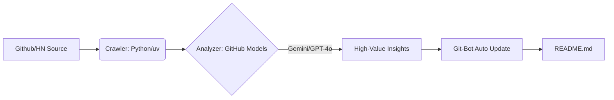

# 🤖 Awesome-Agentic-Business-Workflows

> **工业级 AI Agent 商业工作流百科** —— 由 Iridyne 自动化引擎驱动的公共服务项目。

  
  
   
  
  

---

## 🏛️ 项目说明 / Project Overview

这是一个展示 **AI Agent 自动化工作流** 实战能力的长效运行项目。本仓库目前作为一个“静态展示窗（Showcase）”，由部署在私有仓库的 **Iridyne Factory** 每日自动监测全球 AI 动态并生成报告。

我们致力于将大模型转化为实际生产力，重点关注：
- **实时捕获**：全球高价值 AI 开源项目与商业趋势。
- **深度研判**：利用顶级大模型（Gemini 3 Flash, GPT-4o）进行商业化潜力评估。
- **极简展示**：遵循包豪斯（Bauhaus）工业美学，提供最高信噪比的信息。

---

## 🚀 今日自动化发现 / Automated Insights
<!-- START_HOTSPOT -->
<!-- 此处内容由 Iridyne 自动化引擎每日更新 -->
<!-- END_HOTSPOT -->

> *（以上内容由 Iridyne Bot 每日自动更新。底层驱动：Iridyne Private Factory）*

---

## 🏗️ 垂直化工作流 / Vertical Workflows

### 🕒 Trend Sniffed at 2026-02-10 01:18

❌ AI Reasoning Failed: (unauthorized) Bad credentials
Code: unauthorized
Message: Bad credentials

<!-- END_HOTSPOT -->

> *（以上内容由 Iridyne Bot 每日 UTC 00:00 自动更新。底层驱动：GitHub Actions + Gemini 3 Flash）*

---

## 🏗️ 垂直化工作流 / Vertical Workflows

我们按照“基础设施 -> 垂直行业”的逻辑对全球顶尖 Agent 项目进行动态归类：

### 1. 基础设施层 (The Infrastructure)
- **MCP (Model Context Protocol)**: 连接 AI 与本地专业软件/数据的“最后一公里”。
- **High-Perf Agent Runtimes**: 追求低延迟、高并发的 Agent 容器技术 (Rust/C++ 驱动)。
- **On-Device Intelligence**: 侧重于隐私与边缘计算的端侧 Agent 方案。

### 2. 行业生产流水线 (Industry Pipelines)
- **🛍️ 电商领域**: 从自动选品、素材全自动化生成到投放数据动态监测。
- **✍️ 内容生产**: 爆款基因分析 -> 语境重构 -> 审美迁移 -> 多端自动分发。
- **📈 金融套利**: 针对链上数据与市场情绪的自动化交易及情报响应。

<!-- ---

## 📦 商业化“铲子” / The Shovels
> **与其追逐流量，不如拥有生产流量的机器。**

| 模块名称 | 交付内容 | 赋能场景 |
| :--- | :--- | :--- |
| **[Box-01] 情报工厂** | 本仓库同款嗅探系统，支持自定义信源 | 行业研报、垂直领域自媒体、投研机构 |
| **[Box-02] 流量克隆器** | 针对 TikTok/小红书的视觉风格迁移流水线 | 跨境电商、个人品牌分身、内容矩阵 |
| **[Box-03] 零成本 Agent** | 基于 GitHub 原生环境的免服务器部署模板 | 中小企业提效、独立开发者低成本获客 | -->

---

## 核心逻辑：
1. **自动嗅探**：每日扫描 GitHub Trending & Hacker News。
2. **价值建模**：利用 **Gemini 3 Flash / GPT-4o (mini)** 进行商业可行性评估。
3. **极简交付**：以包豪斯（Bauhaus）工业美学风格呈现最核心的商业逻辑。

---

## 🛠️ 技术矩阵 / Tech Specs

<!--
### 快速开始 / Quick Start
1. **Fork 本仓库**：获取属于你自己的自动化内参站。
2. **配置 Secret**：在 GitHub Setting 中添加 `MODELS_TOKEN` (从 GitHub Models 获取)。
3. **激活 Action**：每日 UTC 00:00 自动为你捕捉全球 AI 商业机会。

- **Engine**: GitHub Models (Primary: Gemini 3 Flash / GPT-4o)
- **Runtime**: Python 3.12 (Managed by `uv`)
- **CI/CD**: GitHub Actions
- **Design Strategy**: Minimalism & Industrial Efficiency-->

---

**Iridyne Organization**
