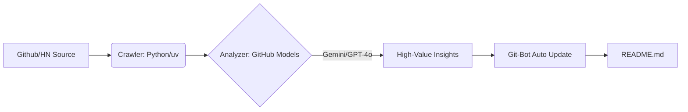

# 🤖 Awesome-Agentic-Business-Workflows

> **工业级 AI Agent 商业工作流百科** —— 拒绝低端对话，专注于将大模型转化为实际生产力的实战流水线。

  
  
  
   
  
  

---

## 🏛️ 核心理念 / Philosophy

在 Web3 与 AI Agent 深度交织的时代，我们不再需要“能聊天的机器人”，我们需要的是 **“自动化、可自循环、具备商业套利能力”**的数字劳动力。本项目基于 **GitHub Models**，利用世界顶级大模型（如 Gemini 3 Flash, GPT-4o）进行趋势捕捉与价值建模。

---

## 🚀 今日自动化发现 / Automated Insights
<!-- START_HOTSPOT -->

### 🕒 Trend Sniffed at 2026-02-09 09:58

⚙️ | **google/langextract** | 商业化潜力: 9/10  
- **核心卖点**：精准提取非结构化文本中的结构化信息，适配企业数据治理与知识管理需求。  
- **价值拆解**：[+] 强调源头溯源与可视化，适合高合规行业；[+] LLM驱动，技术前沿；[-] 依赖LLM性能，可能受限于模型成本。  
- **传送门**：[https://github.com/google/langextract](https://github.com/google/langextract)  

🧠 | **OpenBMB/MiniCPM-o** | 商业化潜力: 8/10  
- **核心卖点**：支持多模态实时流媒体交互，适配移动端场景，填补轻量级多模态市场空白。  
- **价值拆解**：[+] Gemini架构，技术创新；[+] 适配移动端，市场需求大；[-] 需优化性能与功耗平衡。  
- **传送门**：[https://github.com/OpenBMB/MiniCPM-o](https://github.com/OpenBMB/MiniCPM-o)  

🛍️ | **hsliuping/TradingAgents-CN** | 商业化潜力: 8/10  
- **核心卖点**：多智能体LLM驱动的中文金融交易框架，专注高频交易与策略优化。  
- **价值拆解**：[+] 中文金融市场专属优化，差异化竞争力；[+] 多智能体协作，提升交易效率；[-] 需验证稳定性与安全性。  
- **传送门**：[https://github.com/hsliuping/TradingAgents-CN](https://github.com/hsliuping/TradingAgents-CN)  

🧠 | **resemble-ai/chatterbox** | 商业化潜力: 7/10  
- **核心卖点**：开源SoTA级TTS技术，适配语音生成与虚拟助手场景。  
- **价值拆解**：[+] 高质量TTS，适合内容创作与客服；[+] 开源降低准入门槛；[-] 商业化竞争激烈，需差异化应用场景。  
- **传送门**：[https://github.com/resemble-ai/chatterbox](https://github.com/resemble-ai/chatterbox)  

🚀 | **airweave-ai/airweave** | 商业化潜力: 8/10  
- **核心卖点**：为AI代理提供开源上下文检索层，提升任务执行效率与准确性。  
- **价值拆解**：[+] 解决上下文管理痛点，提升AI代理性能；[+] 开源生态，易于集成；[-] 需验证大规模应用场景下的稳定性。  
- **传送门**：[https://github.com/airweave-ai/airweave](https://github.com/airweave-ai/airweave)

<!-- END_HOTSPOT -->

> *（以上内容由 Iridyne Bot 每日 UTC 00:00 自动更新。底层驱动：GitHub Actions + Gemini 3 Flash）*

---

## 🏗️ 垂直化工作流 / Vertical Workflows

我们按照“基础设施 -> 垂直行业”的逻辑对全球顶尖 Agent 项目进行动态归类：

### 1. 基础设施层 (The Infrastructure)
- **MCP (Model Context Protocol)**: 连接 AI 与本地专业软件/数据的“最后一公里”。
- **High-Perf Agent Runtimes**: 追求低延迟、高并发的 Agent 容器技术 (Rust/C++ 驱动)。
- **On-Device Intelligence**: 侧重于隐私与边缘计算的端侧 Agent 方案。

### 2. 行业生产流水线 (Industry Pipelines)
- **🛍️ 电商领域**: 从自动选品、素材全自动化生成到投放数据动态监测。
- **✍️ 内容生产**: 爆款基因分析 -> 语境重构 -> 审美迁移 -> 多端自动分发。
- **📈 金融套利**: 针对链上数据与市场情绪的自动化交易及情报响应。

<!-- ---

## 📦 商业化“铲子” / The Shovels
> **与其追逐流量，不如拥有生产流量的机器。**

| 模块名称 | 交付内容 | 赋能场景 |
| :--- | :--- | :--- |
| **[Box-01] 情报工厂** | 本仓库同款嗅探系统，支持自定义信源 | 行业研报、垂直领域自媒体、投研机构 |
| **[Box-02] 流量克隆器** | 针对 TikTok/小红书的视觉风格迁移流水线 | 跨境电商、个人品牌分身、内容矩阵 |
| **[Box-03] 零成本 Agent** | 基于 GitHub 原生环境的免服务器部署模板 | 中小企业提效、独立开发者低成本获客 | -->

---

## 核心逻辑：
1. **自动嗅探**：每日扫描 GitHub Trending & Hacker News。
2. **价值建模**：利用 **Gemini 3 Flash / GPT-4o (mini)** 进行商业可行性评估。
3. **极简交付**：以包豪斯（Bauhaus）工业美学风格呈现最核心的商业逻辑。

---

## 🛠️ 技术矩阵 / Tech Specs

### 快速开始 / Quick Start
1. **Fork 本仓库**：获取属于你自己的自动化内参站。
2. **配置 Secret**：在 GitHub Setting 中添加 `MODELS_TOKEN` (从 GitHub Models 获取)。
3. **激活 Action**：每日 UTC 00:00 自动为你捕捉全球 AI 商业机会。

- **Engine**: GitHub Models (Primary: Gemini 3 Flash / GPT-4o)
- **Runtime**: Python 3.12 (Managed by `uv`)
- **CI/CD**: GitHub Actions
- **Design Strategy**: Minimalism & Industrial Efficiency

---

**Iridyne Organization** *Est. 2026 | 为新经济构建自动化基石。*

