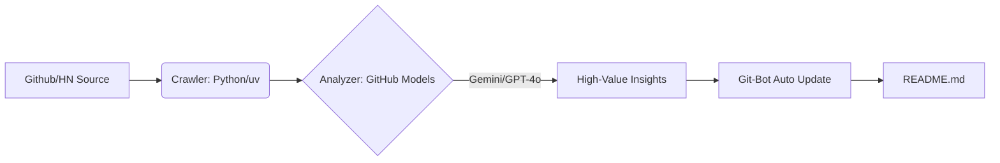

# 🤖 Awesome-Agentic-Business-Workflows

> **Industrial-Grade AI Agent Business Workflows** — Moving beyond chatbots. Focusing on production lines that transform LLMs into tangible productivity.

  
  
  
   
  
  

---

## 🏛️ Philosophy

In the era where Web3 and AI Agents converge, we don't need "chatbots"; we need **Automated, Self-Sustaining, Arbitrage-Ready** digital labor. This project utilizes world-class models (Gemini 3 Flash, GPT-4o) via **GitHub Models** to capture trends and model value.

### Core Logic:
1. **Automated Sniffing**: Daily scans of GitHub Trending & Hacker News for AI breakthroughs.
2. **Value Modeling**: Leveraging **Gemini 3 Flash / GPT-4o (mini)** to assess commercial viability.
3. **Minimalist Delivery**: Presenting core business logic in the Bauhaus industrial style.

---

## 🚀 Automated Insights
<!-- START_HOTSPOT -->

### 🚀 | **Example-Agent-Project** | Potential: 9.5/10
- **Core Value**: Automated execution of complex business arbitrage workflows via distributed multi-agent collaboration.
- **Value Breakdown**: [+] Modular scalability; [+] Minimal token consumption; [-] High barrier for cross-platform environment setup.
- **Portal**: [https://github.com/example/agent-project](https://github.com/example/agent-project)

<!-- END_HOTSPOT -->

> *（Updated daily at 00:00 UTC by Iridyne Bot. Powered by GitHub Actions & Gemini 3 Flash）*

---

## 🏗️ Vertical Workflows

We dynamically categorize top-tier Agent projects from Infrastructure to Vertical Industries:

### 1. The Infrastructure
- **MCP (Model Context Protocol)**: The "last mile" connecting AI to local software and data.
- **High-Perf Agent Runtimes**: Low-latency, high-concurrency agent containers (Rust/C++ driven).
- **On-Device Intelligence**: Privacy-focused and edge-computing agent solutions.

### 2. Industry Pipelines
- **🛍️ E-commerce**: From auto-selection and creative generation to dynamic ad monitoring.
- **✍️ Content Ops**: Viral gene analysis -> Context shifting -> Aesthetic transfer -> Multi-platform distribution.
- **📈 Financial Arbitrage**: Automated trading and sentiment-based intelligence for on-chain markets.

---

## 📦 Commercial "Shovels"
> **Don't just chase the traffic—own the machine that generates it.**

| Product | Deliverables | Best For |
| :--- | :--- | :--- |
| **[Box-01] Intel Factory** | The same automated sniffing system as this repo. | Industry reports, Niche media, Research firms. |
| **[Box-02] Traffic Cloner** | Visual style-shifting pipelines for TikTok/Reels. | E-commerce, Digital twins, Content matrices. |
| **[Box-03] Zero-Cost Agent** | Serverless deployment via native GitHub templates. | SME efficiency, Solo-developers, Low-cost acquisition. |

---

## 🛠️ Tech Matrix

### Quick Start
1. **Fork this Repo**: Get your own automated AI intelligence station.
2. **Configure Secrets**: Add `MODELS_TOKEN` to your GitHub repository secrets (retrieve from GitHub Models).
3. **Enable Actions**: Captures global AI business opportunities automatically at 00:00 UTC daily.

- **Engine**: GitHub Models (Primary: Gemini 3 Flash / GPT-4o)
- **Runtime**: Python 3.12 (Managed by `uv`)
- **CI/CD**: GitHub Actions
- **Design Strategy**: Minimalism & Industrial Efficiency

---

**Iridyne Organization** *Est. 2026 | Building foundations for the New Economy.*
